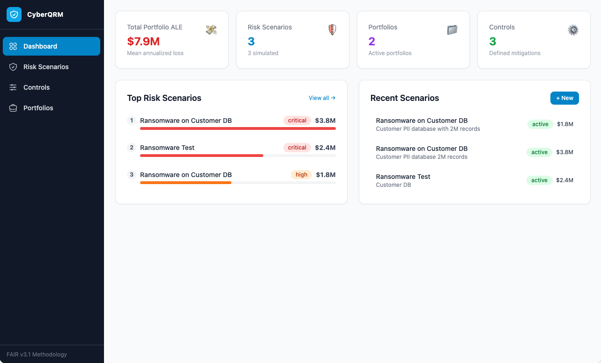
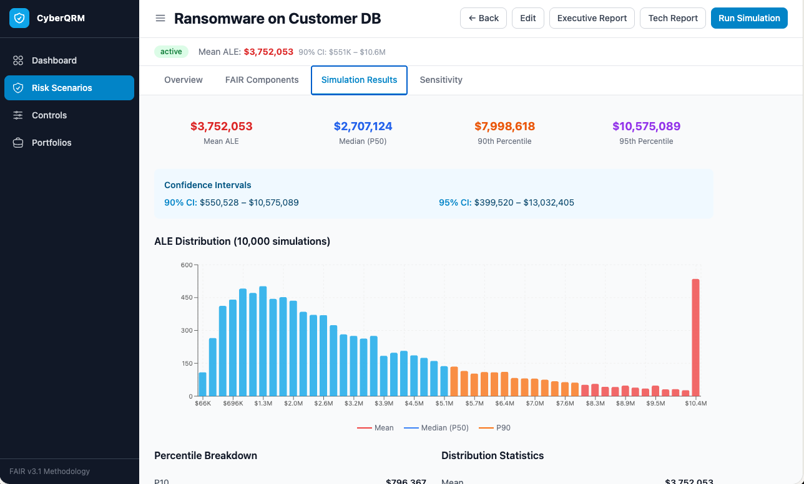

# CyberQRM – Cyber Quantitative Risk Management

A local, open-source platform for **quantitative cybersecurity risk assessment** using the [FAIR v3.1](https://www.fairinstitute.org/) (Factor Analysis of Information Risk) framework. Model threats, run Monte Carlo simulations, measure control effectiveness, and manage risk portfolios — all from your browser, no cloud account required.

---

## Features

- **FAIR-based risk modelling** — define Threat Event Frequency, Vulnerability, Asset Value, and Loss Event Impact for each scenario using triangular, lognormal, or point distributions
- **Multi-basis Asset Valuation** — model asset value as a sum of multiple dimensions (replacement cost, revenue impact, regulatory exposure, business interruption, reputational value) each with its own distribution
- **Primary & Secondary Loss** — FAIR-standard split of loss magnitude into Primary loss forms (Productivity, Response, Replacement) and Secondary loss forms (Fines & Judgements, Reputational Damage, Competitive Advantage), separated by a Secondary Loss Event Frequency (SLEF). Formula: `LM = PLM + SLEF × SLEM`
- **MITRE ATT&CK integration** — browse and select ATT&CK techniques on the TEF and Vulnerability steps; receive active range suggestions based on technique prevalence tiers and mitigation coverage
- **Monte Carlo simulation engine** — 10,000-iteration simulations with configurable seeds for reproducible results
- **Annualised Loss Expectancy (ALE) analytics** — mean, median, percentiles (P10–P99), and 90 %/95 % confidence intervals
- **Sensitivity / tornado charts** — identify which FAIR components drive the most risk
- **Control effectiveness analysis** — model current and proposed controls; calculate ALE reduction, ROI, and payback period
- **Portfolio management** — aggregate multiple scenarios to understand organisation-wide risk
- **Persistent local storage** — SQLite database, no data leaves your machine
- **Fully offline** — no internet connection required after installation (ATT&CK dataset downloaded once at install time)

---

## Screenshots





---

## Prerequisites

| Requirement | Version | Notes |
|-------------|---------|-------|
| **Node.js** | 22.5 or later | Uses the built-in `node:sqlite` module introduced in v22.5 |
| **npm** | ships with Node.js | No separate install needed |

### Installing Node.js

- **Official installer (recommended):** [nodejs.org/en/download](https://nodejs.org/en/download) — choose the "Current" or "LTS ≥ 22" release
- **macOS via Homebrew:** `brew install node`
- **Any platform via nvm:** `nvm install 22 && nvm use 22`
- **Windows via winget:** `winget install OpenJS.NodeJS`

---

## Installation

### macOS / Linux

```bash
# Clone the repository
git clone https://github.com/iiamit/CyberQRM.git
cd CyberQRM

# Run the installer (checks Node version, installs all dependencies, downloads ATT&CK data)
chmod +x install.sh
./install.sh
```

### Windows

```bat
REM Clone the repository (Git Bash, PowerShell, or any terminal)
git clone https://github.com/iiamit/CyberQRM.git
cd CyberQRM

REM Run the installer (double-click or run from a terminal)
install.bat
```

The installer will:
1. Verify Node.js 22.5+ is present and print a helpful error if it isn't
2. Install root, backend, and frontend `npm` dependencies
3. Create the `backend/data/` directory for the SQLite database
4. Download the MITRE ATT&CK Enterprise dataset (~30 MB) — if the download fails the app still works; ATT&CK features will show "data unavailable" until the file is present

---

## Running the App

### macOS / Linux

```bash
./start.sh
```

This opens two terminal windows (or background processes on Linux without a desktop) — one for the backend API and one for the frontend dev server — then opens your browser automatically.

### Windows

```bat
start.bat
```

Two console windows will open (backend and frontend). Your browser will open automatically after 5 seconds.

Once running, access the app at:

| Service | URL |
|---------|-----|
| **Frontend** | http://localhost:5173 |
| **Backend API** | http://localhost:3001 |
| **Health check** | http://localhost:3001/api/health |

> If port 5173 is already in use, Vite will automatically switch to 5174.

---

## How It Works

CyberQRM implements the FAIR v3.1 methodology in four steps:

1. **Define a scenario** — name the asset, threat actor, and business context
2. **Set FAIR parameters** — enter distributions for TEF, Vulnerability, Asset Value, and Loss Impact
3. **Run simulation** — the engine samples each distribution 10,000 times and computes ALE
4. **Analyse results** — review ALE percentiles, sensitivity drivers, and control ROI

### Advanced Scenario Modelling

**Multi-basis Asset Valuation** — toggle "Advanced: use multiple valuation bases" on the Asset Value step to define separate distributions for each value dimension. The simulation sums all bases per iteration.

**Primary & Secondary Loss** — toggle "Advanced: split into Primary & Secondary loss" on the Loss Impact step to model primary direct costs and secondary stakeholder-imposed costs (fines, reputational damage, competitive loss) with a conditional SLEF probability. All amounts are in absolute USD.

**MITRE ATT&CK** — on the TEF and Vulnerability steps, open the technique browser to filter by tactic, search by name or ID, and select relevant techniques. The platform suggests TEF ranges based on real-world prevalence tiers (sourced from Red Canary / CTID sightings) and vulnerability ranges based on how many ATT&CK mitigations you have implemented.

The database is created automatically on first run (`backend/data/cyberqrm.db`). All data stays on your local machine.

---

## Project Structure

```
CyberQRM/
├── backend/               # Express.js + TypeScript API
│   ├── src/
│   │   ├── index.ts       # Server entry point (port 3001)
│   │   ├── db/            # SQLite adapter, schema & migrations
│   │   ├── routes/        # REST endpoints (scenarios, controls, portfolios, ATT&CK)
│   │   ├── services/      # Business logic, Monte Carlo engine & ATT&CK service
│   │   ├── data/          # attack-prevalence.json (bundled TEF tier data)
│   │   └── middleware/    # Error handling
│   └── data/              # SQLite database + ATT&CK STIX file (auto-created)
├── frontend/              # React 18 + Vite + TypeScript
│   └── src/
│       ├── pages/         # Dashboard, Scenarios, Controls, Portfolios
│       ├── components/    # Charts, forms, UI primitives
│       │   └── forms/     # ScenarioForm, AttackTechniqueSelector,
│       │                  #   ValuationBasisList, PrimarySecondaryLossForm
│       ├── store/         # Zustand state management
│       └── utils/         # API client, formatting, report generator
├── shared/                # Shared TypeScript types (FAIR data model)
├── install.sh             # macOS/Linux installer
├── install.bat            # Windows installer
├── start.sh               # macOS/Linux launcher
└── start.bat              # Windows launcher
```

---

## Tech Stack

| Layer | Technology |
|-------|-----------|
| Frontend framework | React 18, TypeScript, Vite |
| Styling | Tailwind CSS |
| State management | Zustand, TanStack React Query |
| Charts | Recharts |
| Backend framework | Express.js, TypeScript |
| Database | SQLite via Node.js built-in `node:sqlite` |
| Validation | Zod |
| Threat intelligence | MITRE ATT&CK Enterprise (STIX 2.1) |

---

## Development

To work on the code with hot-reloading:

```bash
# Install dependencies (if not done already)
./install.sh        # macOS/Linux
install.bat         # Windows

# Start both services with live reload
npm run dev         # from the project root (requires npm-run-all)

# Or start them individually
npm run dev:backend
npm run dev:frontend
```

To build a production bundle:

```bash
npm run build
# Then run the compiled backend:
cd backend && npm start
# Serve frontend/dist with any static file server
```

---

## Contributing

Contributions are welcome. Please open an issue first to discuss significant changes.

1. Fork the repository
2. Create a feature branch (`git checkout -b feature/your-feature`)
3. Commit your changes
4. Open a pull request

---

## License

MIT — see [LICENSE](LICENSE) for details.

---

## Acknowledgements

This project implements the [FAIR™ (Factor Analysis of Information Risk)](https://www.fairinstitute.org/) ontology. FAIR is a trademark of the FAIR Institute.

ATT&CK® is a registered trademark of The MITRE Corporation. ATT&CK content is used under the [ATT&CK Terms of Use](https://attack.mitre.org/resources/terms-of-use/).
